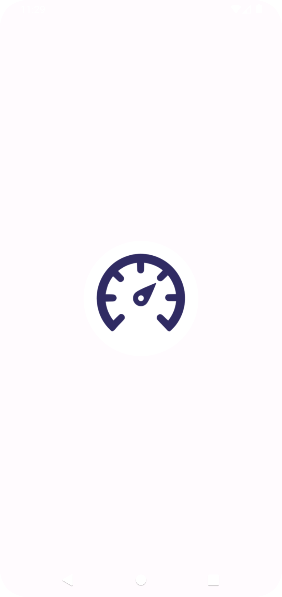
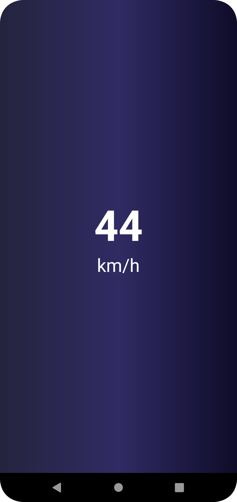

# MotoMeter PRO - Your Ultimate Speedometer App

**MotoMeter PRO** is an innovative Android app that turns your smartphone into a real-time digital speed meter for your bike rides. Say goodbye to expensive meter replacements and enjoy accurate speed tracking at your fingertips.

## Features

- **Real-Time Speed Tracking:** Monitor your riding speed with precision.
- **User-Friendly Interface:** Intuitive design for easy speed monitoring.

## Screenshots

 &nbsp;&nbsp;&nbsp;&nbsp; 

## Motivation

As an Android developer with a passion for innovation, I conceived the idea for MotoMeter PRO. Faced with a damaged bike meter and the costly replacement of around 3k, I harnessed my creativity to develop this app as a cost-effective alternative. MotoMeter PRO transforms smartphones into reliable digital speed meters, providing riders with real-time speed tracking. My future plans include enhancing the app with trip KM tracking and a fuel indicator, further demonstrating my commitment to crafting practical solutions for everyday challenges.

## Future Enhancements

I have exciting plans to enhance MotoMeter PRO further:

- **Trip KM Tracking:** Track your journey distances effortlessly.
- **Fuel Indicator:** Monitor your fuel levels for a comprehensive biking experience.

## How to Use

1. [Download the APK](#link-to-apk).
2. Launch MotoMeter PRO and start tracking your speed!

## Contributing

Contributions are welcome!
